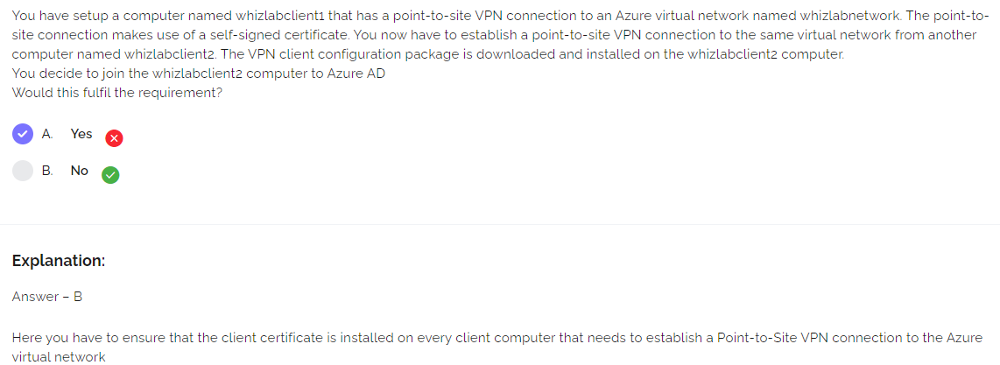

## [Whizlabs Practice Tests](https://www.whizlabs.com/learn/course/microsoft-azure-az-104/)

* [Azure AD built-in roles](https://docs.microsoft.com/en-us/azure/active-directory/roles/permissions-reference)
* Questions
  * Can cloud-device-admin add ad-joined-device to assigned-membership-group (owner = cloud-device-admin)? `Yes`
  * Can cloud-device-admin add ad-joined-device to dynamic-device-group (owner = user-admin)? `No`
  * Can cloud-device-admin add ad-registered-device to assigned-membership-group (owner = cloud-device-admin)? `Yes`
  * Can cloud-device-admin add ad-registered-device to dynamic-device-group (owner = user-admin)? `No`
  * Can user-admin add ad-joined-device to assigned-membership-group (owner = cloud-device-admin)?  `Yes`
  * Can user-admin add ad-joined-device to dynamic-device-group (owner = user-admin)? `Yes`
  * Can user-admin add ad-registered-device to assigned-membership-group (owner = cloud-device-admin)?  `Yes`
  * Can user-admin add ad-registered-device to dynamic-device-group (owner = user-admin)? `Yes`

1. Send logs to Log Analytics workspace
1. Create alerts in Azure Monitor based on those logs

* Which App Insights feature would user 1 want? `Funnels`
* Which App Insights feature would user 2 want? `Impact`
* Which App Insights feature would user 3 want? `Retention`
* Which App Insights feature would user 4 want? `User Flows`

