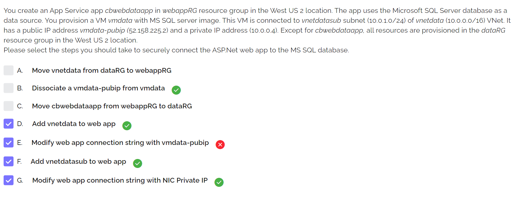
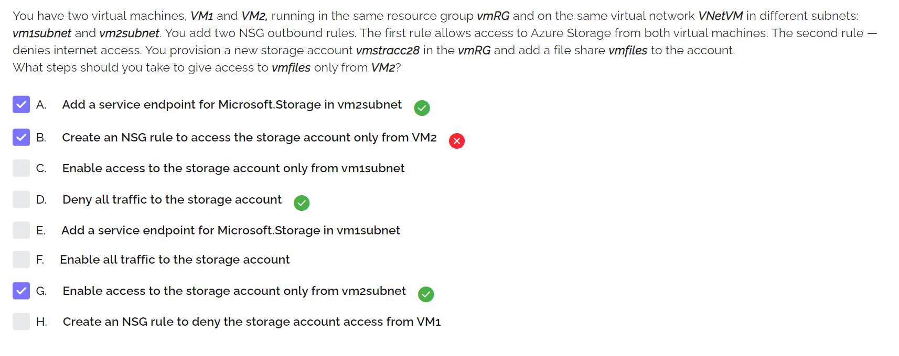
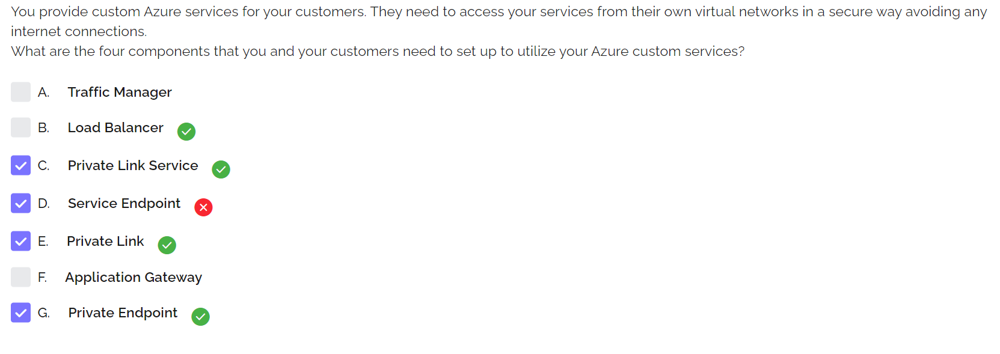

## Test 5
* To increase cpu and mem for an ACI...
    1. delete the ACI
    1. redeploy modified ACI deployment template
* ACI multi-group = docker compose
* App Service auto-scaling...
    1. basic = 3 instances
    1. standard = 10
    1. premium = 30
* App Service AD auth steps...
    1. Select an identity provider
    1. Register the app in AAD
    1. Set App Service authentication settings
* App Service backup setup
    1. `az storage account create`
    1. `az storage container create`
    1. `az webapp config backup update`
* Create administrative units via...
    1. Azure Portal
    1. Powershell
    1. *Microsoft Graph*
* Azure Monitor Insights for Networks components...
    1. Connectivity
    1. Network health and metrics
    1. Traffic
    

